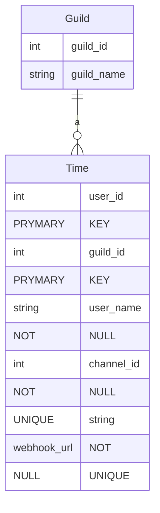
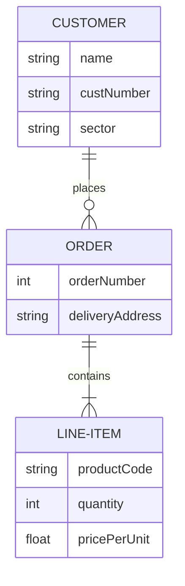
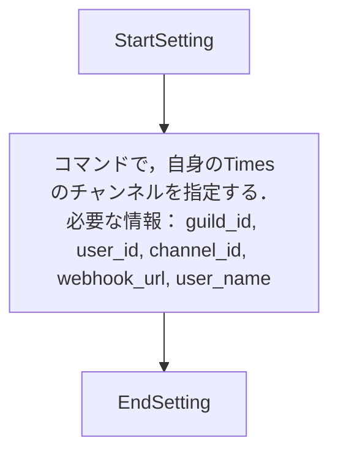
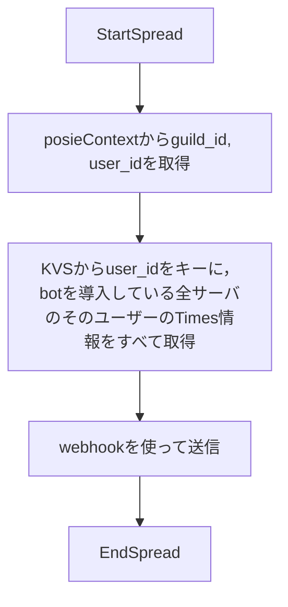

Obsidianでとっていたメモをここにコピー


Cardiacは 心臓の という意
# DiscordのBot招待リンク
```
https://discord.com/oauth2/authorize?client_id=1215172502519812137&permissions=536873984&scope=bot
```

# 必要なコマンド
- ut-c_guild_init
	- ギルドの情報を登録する
	- サーバー管理者が実行するコマンド
	- ただ，実行するユーザーに依存しない
	- ギルドのidと，ギルドの名前を取得してDBに保存する
- ut-c_times_set
	- 実行するユーザーに依存
	- 実行するチャンネルに依存
	- 実行したチャンネルをそのユーザーのTimesとしてDBに保存する
	- ２度目以降は更新と同じ
- ut-c_times_delete
	- 実行するユーザーに依存
	- 実行したユーザーのTimes情報をDBから削除する
- ut-c_times_release
	- 実行するユーザーに依存
	- 実行するチャンネルに依存
	- 実行するギルドに依存
	- 保存されたTimes情報のchannel_idと一致しない場合，チャンネル不一致として弾く
	- 実行したギルド以外の，Timesが登録されているすべてのギルドへ同じ内容を送信する

# 設計
Webhookを使って送信する．
UbiquiTimesと違って，１つのbotを複数のギルドに導入する方式
通常のDiscord Botと同様

# DB設計
```rust
UserTime {
	user_id: u64, // primary key
	guild_id: u64, // primary key foregin key
	user_name: u64
	channel_id: u64,
	webhook_url: String
}

Guild {
	guild_id: u64,
	guild_name: Option<String>, //Discordサーバーを識別するための名前
	// 手動で入力するか？ ギルド名から自動でとるか？
}
```




# 使用技術
- Rust
- poise
- shuttle
- ~~shuttle-parsist~~
	- KVS
	- ...posgreにするか？
- shuttle-shared-db
	- postgre

# フロー



# 雑多

ロギングをやらないと でもあとでね
まだ理解していないことが多すぎる

とりあえずinstrumentをつけておく

postgres numeric型


# ディレクトリ構造
```
|
|- shuttle
|- repository
|- webhook_driver
|- tests
```
repositoryはrepositoryで完結するように
最終的にShuttleが集約して利用する

# メモ・疑問

## トレイト・抽象化・クリーンアーキ？？
トレイトを作る際，エラーハンドリングのためにエラー型を知る必要がある
つまり，具体的にどんな実装，ライブラリを使っていて，それはどんなエラー型なのか
thiserrorでハンドリングするにも，それをトレイトと同じところで知っていないとできなくないか？
エラー情報を保持したままハンドリングするために

どうやってやっているんだ？

パット見た感じ，なんかクリーンアーキ（をうたっている実装．クリーンアーキを知らないので判断不可能）ではdomainなんとかにトレイトを置いているようだ．
ひとまずの解決策として，repositoryならrepositoryでトレイトも具体実装も完結させることにした．

関連型を使って何かできないか？

# エラー
```
  left: [UtTime { user_id: 13729774730268838528, guild_id: 11355424615209491995, user_name: "user_name_2", channel_id: 11613312544612496881, webhook_url: "webhook_url_2" }, UtTime { user_id: 13729774730268838528, guild_id: 16906684204110425439, user_name: "user_name", channel_id: 15440042166973726002, webhook_url: "webhook_url" }]
 right: [UtTime { user_id: 13729774730268838528, guild_id: 16906684204110425439, user_name: "user_name", channel_id: 15440042166973726002, webhook_url: "webhook_url" }, UtTime { user_id: 13729774730268838528, guild_id: 11355424615209491995, user_name: "user_name_2", channel_id: 11613312544612496881, webhook_url: "webhook_url_2" }]
note: run with `RUST_BACKTRACE=1` environment variable to display a backtrace
```

# 人力テスト記録
## テストサーバー
- guild init: ok
- times set: ok
- release: ok


## ナン工房
- guild init: ok
- times set: ok 
- release: failed
	- poise webhook message sender error: Webhook error: Unknown Webhook
- release: ok

## そのほか
意図しないwebhookが削除されてしまう問題
修正完了

発信元のTimesにも送信されてしまう問題
修正完了

shuttleへのデプロイ時，テストに使っているDB URLがローカルのもののため，その部分のテストを実行できずにクラッシュしてしまう問題
違うっぽい...?
さっきデプロイ通ったのはなんだったの？？
仕方ないので，DBのクエリのところでマクロを使わないようにした

未解決
